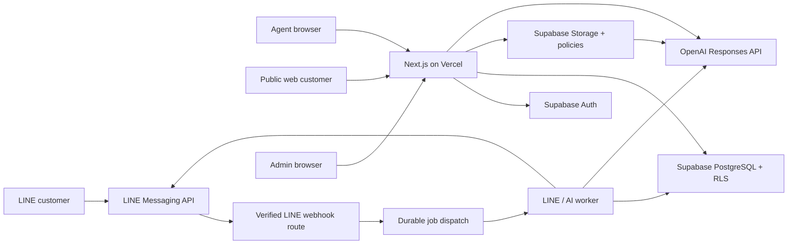
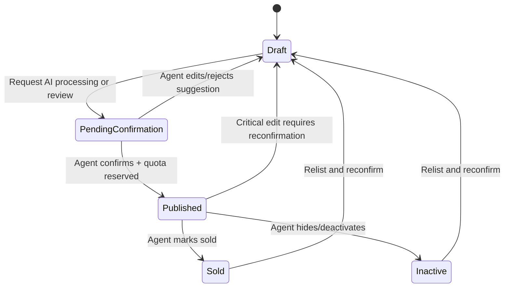
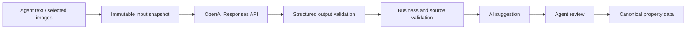

# MESUB AI V1 TECHNICAL BLUEPRINT

Version: 0.2 Final
Date: 20 Aug 2026
Status: Final Blueprint Approved — Phase 0 Authorized
Source of Truth: `PROJECT_CONSTITUTION_MESUB_AI.md` Version 1.2
Scope: Web + LINE OA

## 1. Purpose

เอกสารนี้กำหนด Technical Blueprint สำหรับ Mesub AI V1 ก่อนเริ่มเขียนโค้ด โดยแปลง Product Constitution ให้เป็นขอบเขตระบบ สถาปัตยกรรม โครงสร้างข้อมูล สิทธิ์ การไหลของงาน และเกณฑ์ตรวจรับที่นำไปพัฒนาได้

Blueprint นี้ยังไม่ใช่ implementation และไม่อนุญาตให้เริ่มเขียนระบบจนกว่าจะได้รับการอนุมัติจากเจ้าของโครงการ

## 2. Constitution Alignment

ข้อกำหนดที่ระบบต้องรักษาโดยไม่มีข้อยกเว้น:

- Mesub AI เป็นแพลตฟอร์ม Multi-Agent / Multi-Tenant
- Property และข้อมูลหลังบ้านทุกส่วนต้องระบุ Tenant และเจ้าของข้อมูลอย่างชัดเจน
- Agent เห็นและจัดการเฉพาะข้อมูลที่ตนมีสิทธิ์
- Agent ต้องยืนยันข้อมูลก่อน Publish
- AI ช่วยแยก จัดรูป และร่างข้อมูล แต่ห้ามแต่งข้อมูลสำคัญที่ไม่มีแหล่งที่มา
- Free Plan มี Active Property ได้พร้อมกันสูงสุด 3 รายการ
- Sold/Inactive คืน Active slot และ Draft ต้องไม่ถูกทำลายเพราะเกินโควตา
- Lead ที่สัมพันธ์กับ Property ต้อง Trace กลับไปยัง Property และ Agent เจ้าของทรัพย์ได้
- V1 ต้องวัด Usage และเตรียม Plan/Entitlement/Billing references แม้ยังไม่รับเงินจริง
- Security และ Tenant isolation เป็นฐานของระบบ ไม่ใช่งานเพิ่มภายหลัง

## 3. V1 Goals

V1 ต้องทำให้เส้นทางหลักต่อไปนี้ใช้งานจริงแบบ end-to-end:

1. Agent สมัครและเข้าสู่ระบบ
2. ระบบสร้าง Tenant ส่วนตัวและ Agent Profile
3. Agent เพิ่มข้อมูลทรัพย์และรูปภาพ
4. AI แยกและจัดโครงสร้างข้อมูล พร้อมร่างคำอธิบาย
5. Agent ตรวจ แก้ไข และยืนยัน
6. ระบบตรวจสิทธิ์ สถานะ และโควตาก่อน Publish
7. ลูกค้าค้นหาและดูทรัพย์ที่ Published บน Web
8. ลูกค้าค้นหา/สนทนาผ่าน LINE OA
9. ระบบเก็บความต้องการและ Lead
10. Lead ถูก Route ไปยัง Agent เจ้าของทรัพย์อย่างตรวจสอบย้อนหลังได้
11. Admin ตรวจสอบ ระงับ หรือซ่อนข้อมูลที่มีปัญหาได้

## 4. V1 Non-Goals

- รับเงินจริง ชำระเงิน ใบเสร็จ ภาษี หรือ Payment webhook
- การตั้งราคาแพ็กเกจเสียเงิน
- Mobile native application
- CRM เต็มรูปแบบนอกเหนือจาก Lead status และประวัติที่จำเป็น
- ระบบทีม/เอเจนซีหลายระดับที่ซับซ้อน
- Duplicate detection หรือ identity/property verification ขั้นสูง
- ระบบ recommendation แบบ ML ที่ต้องฝึกโมเดลเอง
- Microservices, Kubernetes หรือ event platform ที่เกินความจำเป็นของ V1
- การให้ AI Publish หรือเปลี่ยนข้อมูลสำคัญโดยอัตโนมัติ

## 5. Initial Technology Stack

| Layer | Technology | Responsibility |
|---|---|---|
| Web application | Next.js App Router + TypeScript | Public marketplace, Agent dashboard, Admin UI, BFF/API routes |
| Hosting/runtime | Vercel | Web deployment, server functions, preview environments, scheduled work |
| Authentication | Supabase Auth | Agent/Admin authentication and session management |
| Database | Supabase PostgreSQL | Transactional data, tenant boundaries, RLS, audit and usage records |
| Media | Supabase Storage | Property images and controlled upload/access |
| AI | OpenAI API, server-side only | Property extraction, normalization, copy drafting and conversational matching |
| Customer messaging | LINE Messaging API | Webhook ingestion, replies/push messages and customer identity channel |
| Observability | Vercel logs + structured application logs + database audit tables | Operational diagnosis, security and business traceability |

Package versions and exact OpenAI model names must be pinned during implementation after checking current official documentation and cost/quality tests. Product rules must never depend directly on a particular AI model or payment provider.

### Region decision

- Supabase production region: Singapore
- Vercel Functions: Singapore หรือ region ที่ใกล้ Supabase production database ที่สุด
- ก่อน Production ต้องตรวจข้อกำหนด data residency และ Data Processing Agreement ของ Supabase, Vercel และ OpenAI อีกครั้ง
- Preview/Staging ต้องไม่ใช้ Production data โดยค่าเริ่มต้น

## 6. High-Level Architecture

### Architectural style

- เริ่มเป็น modular monolith หนึ่ง Next.js application เพื่อลดต้นทุนและภาระดูแล
- แยก Domain boundaries ในโค้ดและฐานข้อมูลให้ชัด แม้อยู่ใน deployment เดียวกัน
- ใช้ Server Components สำหรับงานอ่านและ rendering เป็นค่าเริ่มต้น
- ใช้ Server Actions สำหรับ mutation ที่มาจาก UI และ Route Handlers สำหรับ public APIs, webhooks และ integration endpoints
- ใช้ Node.js runtime สำหรับ OpenAI, LINE signature verification และงาน server-side ที่ต้องใช้ SDK/crypto
- ให้ Server Functions อยู่ใกล้ Supabase region เพื่อลด latency
- ห้ามเรียก OpenAI หรือใช้ LINE channel secret/access token จาก browser

## 7. Tenant Model

### Decision

ใช้ `tenants` และ `tenant_memberships` ตั้งแต่ V1 แทนการถือว่า `auth.users.id` คือ Tenant โดยตรง

- ผู้สมัครใหม่ได้รับ Personal Tenant หนึ่งรายการโดยอัตโนมัติ
- Agent หนึ่งคนเป็น `owner` ของ Personal Tenant ใน V1
- โครงสร้าง membership รองรับการเพิ่มทีม/เอเจนซีภายหลังโดยไม่ต้องย้าย ownership ของข้อมูลทั้งหมด
- `agent_profiles` เป็นตัวตนเชิงธุรกิจของผู้ใช้ ส่วน `auth.users` เป็นตัวตนสำหรับ authentication
- V1 ใช้ Email + Password + Email Verification เป็น authentication หลัก
- Google Login เพิ่มได้เมื่อไม่เพิ่มความซับซ้อนอย่างมีนัยสำคัญ และต้อง map กลับมายัง identity/membership เดิมอย่างปลอดภัย
- LINE Login ไม่อยู่ใน Core V1 แต่ identity model ต้องรองรับการเชื่อม external identity ภายหลังโดยไม่ใช้ LINE user ID เป็น primary user ID
- Platform Admin ต้องรองรับ MFA ก่อน Production
- Tenant-owned tables ทุกตารางต้องมี `tenant_id NOT NULL`
- Record ที่ต้องระบุผู้รับผิดชอบรายบุคคลเพิ่ม `owner_agent_id` หรือ `assigned_agent_id`

### Roles

| Role | Scope | V1 capability |
|---|---|---|
| `tenant_owner` | Tenant | จัดการ Profile, Property, Media, Lead และสถานะของ Tenant ตนเอง |
| `tenant_member` | Tenant | เตรียม schema ไว้ แต่ยังไม่เปิด workflow ทีมเต็มรูปแบบ |
| `platform_admin` | Platform | Moderation, suspension, support และ audit ตามสิทธิ์ที่กำหนด |
| `public/anon` | Public | อ่านเฉพาะข้อมูลทรัพย์ที่ Published และไม่ถูก Admin ซ่อน/Suspend/Archive |

ห้ามใช้ค่าใน user-editable metadata เป็นฐานตัดสินสิทธิ์ Admin หรือ Tenant role การตัดสินสิทธิ์ต้องอ้าง membership/role ที่ระบบควบคุม และยืนยันซ้ำที่ server/database

## 8. Domain Boundaries

| Domain | Responsibility |
|---|---|
| Identity | Auth session, user bootstrap and platform role |
| Tenancy | Tenant and membership boundaries |
| Agent | Public/private agent profile |
| Property | Canonical property record, lifecycle and ownership |
| Media | Upload metadata, ordering, visibility and storage objects |
| AI Processing | Input snapshots, extraction, draft outputs, validation and usage |
| Publishing | Agent confirmation, quota check, self-publish and public projection |
| Search/Matching | Public filters and ranked candidate retrieval |
| LINE | Channel event ingestion, conversation state and outbound messages |
| Lead | Customer intent, source attribution, status and consent metadata |
| Lead Routing | Deterministic property-to-owner assignment and routing history |
| Notifications | Dashboard/email delivery abstraction; extensible to LINE after account linking and consent |
| Plans/Usage | Entitlements, counters and usage ledger |
| Admin/Moderation | Review, suspension and policy actions |
| Audit | Important user/admin/system actions and trace IDs |

## 9. Data Model

ชื่อและรายละเอียด column อาจปรับเล็กน้อยใน schema design review แต่ความสัมพันธ์และข้อบังคับในส่วนนี้ถือเป็น baseline

### 9.1 Identity and tenancy

#### `profiles`

- `user_id uuid PK` references Supabase Auth user
- `display_name`, `phone`, `locale`
- `platform_role` — user/admin; ค่าถูกควบคุมโดยระบบ
- `status` — active/suspended
- timestamps

#### `tenants`

- `id uuid PK`
- `type` — personal; reserved for agency later
- `name`, `slug`
- `status` — active/suspended/archived
- `created_by_user_id`
- timestamps

#### `tenant_memberships`

- `id uuid PK`
- `tenant_id`, `user_id`
- `role` — owner/member
- `status` — active/invited/revoked
- unique active membership rule
- timestamps

#### `agent_profiles`

- `id uuid PK`
- `tenant_id NOT NULL`
- `user_id NOT NULL`
- public contact/branding fields
- private operational fields kept separate or column-restricted
- `verification_status`
- timestamps

### 9.2 Properties and media

#### `properties`

- `id uuid PK`
- `tenant_id NOT NULL`
- `owner_agent_id NOT NULL`
- `status` — draft/pending_confirmation/published/sold/inactive
- `moderation_status` — clear/hidden/suspended/archived; ไม่ใช่ pre-publish approval gate ใน V1
- open risk/policy flags เก็บใน moderation cases และไม่ทำให้ประกาศหายโดยอัตโนมัติ จนกว่า Admin จะสั่ง hide/suspend/archive
- `listing_type` — sale/rent
- `property_type` — land/detached_house/townhouse/condominium/commercial_building/other
- title and structured description
- price amount/currency with explicit source status
- address fields; exact coordinate visibility controlled separately
- bedrooms, bathrooms, land/building area and normalized units
- `published_at`, `sold_at`, `inactive_at`, `archived_at`
- `version` for optimistic concurrency
- timestamps

Business constraints:

- Tenant ของ `owner_agent_id` ต้องตรงกับ `properties.tenant_id`
- Published ต้องมี confirmation ล่าสุด, ไม่อยู่ในสถานะ Admin restriction และมี entitlement slot
- Agent สามารถ Publish ได้เองหลังยืนยันข้อมูลสำคัญและผ่าน quota/security validation โดยไม่ต้องรอ Admin pre-approval
- Public query ต้องเห็นเฉพาะ `status = published` และไม่อยู่ใน `hidden/suspended/archived`
- การลบใน UI เป็น archive/soft delete; physical deletion เป็น controlled retention process

Property required fields ขั้นต่ำ:

- listing type และ property type
- title และ description
- จังหวัดและอำเภอ/เขต
- ราคาและสกุลเงิน
- พื้นที่พร้อมหน่วย
- รูปอย่างน้อย 1 รูป
- Agent contact configuration
- Agent confirmation

ใช้ Conditional Fields ตามประเภททรัพย์ เช่น bedrooms, bathrooms, usable area หรือ land area รองรับหน่วย `ตร.ม.`, `ตร.ว.` และ `ไร่-งาน-ตร.ว.` พร้อม normalized numeric value สำหรับ Search

#### `property_media`

- `id uuid PK`
- `tenant_id`, `property_id`
- `storage_bucket`, `storage_path`
- MIME type, size, width, height, checksum
- `kind`, `sort_order`, `visibility`
- upload/scan status
- timestamps and archived marker

Storage path ต้องเริ่มด้วย Tenant และ Property IDs เช่น `{tenant_id}/{property_id}/{media_id}` เพื่อช่วย enforce ownership และ audit ห้ามเชื่อ path ที่ส่งจาก client โดยไม่ตรวจเทียบ database record

#### `property_confirmations`

- `id uuid PK`
- `tenant_id`, `property_id`
- `property_version`
- `confirmed_by_user_id`, `confirmed_at`
- snapshot/hash ของข้อมูลสำคัญที่ยืนยัน
- source AI run (nullable)

การแก้ข้อมูลสำคัญหลัง confirmation ทำให้ confirmation เดิมไม่เพียงพอและต้องกลับเข้า confirmation flow

Critical fields ที่ทำให้ต้องยืนยันใหม่:

- ราคาและเงื่อนไขขาย/เช่า
- ประเภททรัพย์และประเภทประกาศ
- จังหวัด อำเภอ/เขต ตำแหน่งและพิกัด
- พื้นที่และหน่วย
- กรรมสิทธิ์หรือข้อมูลสิทธิในทรัพย์
- สถานะขาย/เช่า
- Owner/Agent
- ข้อมูลสำคัญที่ AI สกัดหรือแก้ไขใหม่

การแก้ข้อความทั่วไป รูปปก ลำดับรูป หรือข้อความการตลาดที่ไม่เปลี่ยนข้อเท็จจริงไม่ทำให้ต้องยืนยันข้อมูลทั้งหมดใหม่ แต่ต้องเก็บ Audit และ Version History

#### `property_sources`

- `id uuid PK`
- `tenant_id`, `property_id`
- `field_name`
- `source_type` — agent_input/image/system_verified/import
- reference to input/media/message
- raw value, normalized value and confidence where applicable
- timestamps

ตารางนี้ทำให้ตรวจสอบได้ว่าราคา พิกัด และข้อมูลสำคัญมาจากที่ใด

### 9.3 AI processing

#### `ai_runs`

- `id uuid PK`
- `tenant_id`, `requested_by_user_id`
- purpose, status and model identifier
- input snapshot/reference; หลีกเลี่ยงเก็บข้อมูลเกินจำเป็น
- output JSON, schema version and validation status
- provider request/response IDs where available
- token/input/output usage, latency and estimated cost fields
- error category; ห้ามเก็บ secret
- timestamps

#### `ai_suggestions`

- `id uuid PK`
- `tenant_id`, `property_id`, `ai_run_id`
- suggestion type and structured payload
- status — proposed/accepted/rejected/superseded
- accepted/rejected by and timestamp

AI output ไม่เขียนทับ canonical property fields โดยตรง การยอมรับ suggestion ต้องเป็น explicit mutation และเก็บ attribution

### 9.4 Public search

#### `public_property_projection`

ใช้ view แบบ `security_invoker` หรือ table projection ที่ดูแลด้วย transaction ขึ้นกับ performance test ระหว่าง implementation

- แสดงเฉพาะ field ที่อนุญาตเป็น Public
- ไม่เปิด internal notes, exact private contact data, raw AI inputs หรือ Lead data
- รองรับ filter ด้วย property type, listing type, price range, area/location, bedroom and status
- V1 ใช้ PostgreSQL indexes/full-text/trigram ตามผล query plan ก่อนเพิ่ม search service ภายนอก

### 9.5 LINE and conversations

#### `line_users`

- `id uuid PK`
- LINE user ID เก็บแบบ encrypted/controlled access ตามความเหมาะสม
- consent/privacy timestamps
- display profile cache with expiry
- blocked/deleted markers

#### `line_webhook_events`

- `id uuid PK`
- `webhook_event_id UNIQUE` สำหรับ idempotency
- event type, source type, occurred timestamp
- raw payload แบบจำกัด retention/redacted ตามนโยบาย
- processing status, attempts and last error
- received/processed timestamps

#### `conversations`

- `id uuid PK`
- channel — line/web
- customer/LINE identity reference
- state, last activity, consent state
- active lead reference (nullable)

#### `conversation_messages`

- `id uuid PK`
- conversation, direction, type
- LINE message/reply references
- redacted text/payload as permitted
- timestamps, unsent/deleted markers

เมื่อได้รับ LINE unsend event ต้องทำให้เนื้อหาที่เกี่ยวข้องไม่สามารถแสดงหรือใช้ต่อ ตาม retention policy

### 9.6 Leads and routing

#### `leads`

- `id uuid PK`
- `tenant_id NOT NULL` เมื่อ Lead ถูกผูกกับ Agent แล้ว
- `property_id` nullable only for general inquiry
- `source` — web_property/web_general/line_property/line_general/admin
- customer contact/LINE reference with controlled access
- requirement snapshot
- status — new/contacted/qualified/closed_won/closed_lost/spam
- consent and privacy timestamps
- `intake_status` — not_applicable/pending_assignment/assigned/closed สำหรับ General Lead
- timestamps

#### `lead_routing_events`

- `id uuid PK`
- `lead_id`
- `property_id`, `from_tenant_id`, `to_tenant_id`
- `to_agent_id`
- reason/rule version
- status — assigned/notified/failed/reassigned
- idempotency key, attempts and timestamps

Routing rule V1:

1. Lead ที่เกิดจาก Property ต้องใช้ Tenant และ Owner จาก canonical Property record ฝั่ง server
2. ห้ามรับ Agent ID จาก client แล้วเชื่อโดยตรง
3. บันทึก routing event ก่อน/พร้อม notification อย่างเป็น transaction-safe flow
4. การ retry ต้องไม่สร้าง Lead หรือแจ้ง Agent ซ้ำโดยไม่มี idempotency
5. General inquiry ที่ยังไม่มี Property เก็บใน Platform Intake Queue และไม่ใช้ Random หรือ Round-robin

General Lead rule V1:

- General Lead เข้า Platform Intake Queue และไม่มี `tenant_id` จนกว่า Admin assign
- Admin assignment ต้องบันทึกผู้ assign, Agent/Tenant ที่ได้รับ, เวลา และเหตุผล
- หากลูกค้าเลือก Property เฉพาะภายหลัง ให้ route ตาม canonical owner ของ Property และบันทึก routing event ใหม่

### 9.7 Notifications

#### `notifications`

- `id uuid PK`, `tenant_id`, recipient user/agent reference
- type, business subject type/id and template version
- channels requested — dashboard/email; LINE reserved for future
- status, created/read timestamps
- idempotency key

#### `notification_deliveries`

- notification ID, channel and destination reference
- provider message reference, attempt, status and last error
- sent/delivered/failed timestamps

V1 แจ้ง Lead ผ่าน Dashboard และ Email โดยเรียกผ่าน Notification abstraction เดียวกัน ห้ามฝัง email provider หรือ LINE-specific logic ใน Lead domain การแจ้ง Agent ผ่าน LINE ยังไม่เปิดจนกว่าจะมี Account Linking และ Consent Flow ที่อนุมัติแล้ว

### 9.8 Plans, entitlements and usage

#### `plans`

- `id`, `code`, `name`, `status`, `version`
- ไม่มีราคาบังคับใน V1 แรก

#### `plan_entitlements`

- `plan_id`, `key`, typed value
- Free baseline: `active_property_limit = 3`
- Commercial entitlements แยกจาก Technical/Security safety caps อย่างชัดเจน

#### `subscriptions`

- `id`, `tenant_id`, `plan_id`
- status and effective period
- billing customer/provider references nullable
- V1 สร้าง default Free subscription; ไม่มี checkout หรือ payment collection

#### `usage_events`

- immutable event ledger
- `tenant_id`, category, quantity, unit
- source type/id, idempotency key
- provider/model metadata when relevant
- occurred/recorded timestamps

#### `usage_period_summaries`

- summarized counters per tenant/category/period
- ใช้เพื่อ dashboard/cost analysis แต่ ledger เป็นแหล่ง audit

Active Property quota ไม่ใช้ eventually-consistent summary เป็นตัวตัดสินเพียงอย่างเดียว การ Publish ต้องตรวจและจอง slot ภายใน database transaction/locking strategy เพื่อกัน concurrent publish ทำให้เกิน 3 รายการ

Commercial Rule ของ Free Plan ใน V1 มีเพียง Active Properties สูงสุด 3 รายการ Technical Safety Caps สามารถใช้กับ AI requests/tokens, image/media usage, media size, lead submission, API และ webhook abuse แต่ห้ามแสดงเป็น Pricing หรือ Paid Package Rule

### 9.9 Moderation and audit

#### `moderation_cases` / `moderation_actions`

- subject type/id, reporter, reason, evidence reference
- status, assigned admin, resolution
- action type, before/after snapshot and timestamps

Admin V1 สามารถ inspect, flag, hide, suspend และ archive Property พร้อมตรวจ Audit History ทุก action ต้องมีเหตุผลและ actor/timestamp Architecture เก็บ signals/status ที่ต่อยอด Risk-based Moderation ได้ แต่ V1 ไม่มี Trust Score หรือ Moderation Engine เต็มรูปแบบ

#### `audit_logs`

- actor type/id, tenant context
- action, resource type/id
- result, request/trace ID
- safe metadata and timestamp
- append-only for application roles

## 10. Row-Level Security and Authorization

RLS เปิดบนทุก table ใน exposed schema และใช้ least privilege grants ควบคู่กัน Service role/secret key ห้ามอยู่ใน browser

| Resource | Public | Tenant member | Platform admin |
|---|---|---|---|
| Public property projection | อ่าน Published ที่ไม่ถูก hidden/suspended/archived | เหมือน Public | อ่านเพื่อ moderation |
| Properties | ไม่มี direct private access | CRUD เฉพาะ membership ที่ตรง `tenant_id` | ผ่าน admin service path ที่ audit |
| Property media | Public เฉพาะ published media | จัดการเฉพาะ Tenant/Property ของตน | controlled moderation access |
| AI runs/suggestions | ไม่มี | อ่าน/สร้างเฉพาะ Tenant ตน | support access แบบจำกัดและ audit |
| Leads | ไม่มี | อ่าน/แก้เฉพาะ Lead ที่ route เข้า Tenant | controlled support/moderation access |
| Usage/subscription | ไม่มี | อ่านของ Tenant ตน | controlled finance/support access |
| Audit logs | ไม่มี | อ่านเฉพาะ subset ที่กำหนดในภายหลัง | privileged audited access |

Rules เพิ่มเติม:

- Server-side authorization ต้องทำก่อน mutation สำคัญ แม้ RLS จะป้องกันชั้นฐานข้อมูลอยู่แล้ว
- RLS update policy ต้องตรวจทั้ง row เดิมและค่าหลัง update เพื่อกันย้าย ownership
- Ownership columns ห้ามแก้ผ่าน generic update form
- Functions/views ใช้ invoker rights เป็นค่าเริ่มต้น
- หากจำเป็นต้องใช้ privileged database function ให้อยู่ใน non-exposed schema, revoke public execute, ตรวจ actor ภายใน และทำ security review แยก
- Admin actions ทุกครั้งต้องมีเหตุผลและ audit record

## 11. Property State Machine

### Publish transaction

1. Authenticate actor and resolve active Tenant membership
2. Lock/check Property and ensure ownership matches Tenant
3. Confirm required fields and a current confirmation snapshot
4. Ensure Property is not hidden/suspended/archived by Admin; no pre-publish approval is required
5. Read effective entitlement from Subscription/Plan
6. Count/reserve active slot under transaction-safe locking
7. Change state to Published and set timestamp
8. Write usage and audit events
9. Commit, then refresh/revalidate public representation

คำว่า Active ใน V1 หมายถึง `Published` เท่านั้น เว้นแต่ Product Constitution จะเพิ่มสถานะ Active อื่นในภายหลัง

## 12. Web Information Architecture

### Public routes

- `/` — landing/search entry
- `/properties` — search and filters
- `/properties/[publicIdOrSlug]` — property detail and lead CTA
- `/agents/[slug]` — public Agent profile (minimal V1)
- `/privacy`, `/terms` — required policy pages before public launch

### Public disclosure policy

ใช้ Limited Disclosure เป็นค่าเริ่มต้น Public เห็นชื่อ Agent/แบรนด์ ข้อมูลที่ Agent อนุญาต จังหวัด อำเภอ/เขต ย่านโดยประมาณ และปุ่มติดต่อผ่านระบบหรือ LINE OA ไม่แสดง Exact GPS, private back-office fields หรือข้อมูลที่ระบุตำแหน่งบ้านละเอียดเกินจำเป็น Agent ยังเปิดตำแหน่งละเอียดไม่ได้ใน Core V1; ความสามารถนี้เพิ่มได้ภายหลังเมื่อมี Confirmation และ Policy รองรับ Lead จาก Property page ต้องเก็บ `property_id` เสมอเพื่อ route ไป canonical owner

### Agent routes

- `/login`, `/signup`, auth callback
- `/dashboard`
- `/dashboard/properties`
- `/dashboard/properties/new`
- `/dashboard/properties/[id]/edit`
- `/dashboard/properties/[id]/review`
- `/dashboard/leads`
- `/dashboard/leads/[id]`
- `/dashboard/usage`
- `/dashboard/plan`
- `/dashboard/profile`

### Admin routes

- `/admin/moderation`
- `/admin/properties/[id]`
- `/admin/agents/[id]`
- `/admin/audit`

Route visibility ไม่ถือเป็น authorization ทุก page/action ต้องตรวจ session, membership และ role ฝั่ง server

## 13. Application/API Boundaries

### Server Actions

ใช้สำหรับ form mutations ที่มาจาก authenticated Agent/Admin UI เช่น create/update draft, accept suggestion, confirm, publish, mark sold และ update lead status

### Route Handlers

- `POST /api/line/webhook` — raw-body signature verification and idempotent event intake
- `POST /api/leads` — public lead capture with validation, consent and abuse controls
- `POST /api/ai/property-extractions` — authenticated orchestration endpoint หาก UX ต้องใช้ streaming/progress; ไม่เช่นนั้นใช้ Server Action
- Internal job/cron endpoints ต้องใช้ secret/OIDC protection และไม่เปิดเป็น public business API

### Contract rules

- Validate all untrusted input with runtime schemas
- Return stable error codes separate from localized messages
- Mutation endpoints accept idempotency keys where retry/duplicate risk exists
- Never accept trusted `tenant_id`, `owner_agent_id`, quota or role values from the browser
- Use request/trace ID across application logs, AI runs, webhooks and routing events

Authentication V1 ใช้ Email + Password + Email Verification Google Login เป็น optional enhancement เท่านั้น และ LINE Login ไม่อยู่ใน Core V1

## 14. AI Architecture

### Supported V1 use cases

1. Parse free-form Agent text into candidate property fields
2. Read relevant details from uploaded images where permitted
3. Normalize values and units
4. Draft Thai property title/description
5. Convert customer requirements into a structured search query
6. Rank/explain matches from database-retrieved candidates
7. Draft bounded LINE responses

### Task-based model profiles

Model configuration ต้องเปลี่ยนจาก Server Configuration ได้และห้าม hard-code ชื่อโมเดลใน Business Logic แบ่งอย่างน้อยเป็น:

- Extraction / normalization
- Vision
- LINE intent / conversation
- Content generation
- Fallback / complex reasoning

เริ่มจากโมเดลที่สมดุลราคาและคุณภาพ แล้ว escalate เฉพาะงานที่จำเป็น ก่อน Production ต้องมี Thai Evaluation Set จากข้อมูลอสังหาริมทรัพย์จริงเพื่อประเมิน structured extraction, ภาษาไทย, ความแม่นยำของ Property facts, LINE intent และค่าใช้จ่ายต่อ task

### Processing pattern

### Guardrails

- ใช้ Structured Outputs/JSON schema สำหรับ extraction และ search intent
- ทุก field แสดง source, confidence/unknown state และ validation result
- หากไม่มีหลักฐานให้คืน `unknown/null` ไม่เดาค่า
- ราคา พิกัด กรรมสิทธิ์ และเงื่อนไขสำคัญต้องมี explicit source และ Agent confirmation
- AI prompt ต้องได้รับเฉพาะข้อมูลที่จำเป็น และไม่รวมข้อมูลของ Tenant อื่น
- Search flow ต้องดึง candidate ที่ user มีสิทธิ์เห็นจากฐานข้อมูลก่อน แล้วให้ AI ช่วยตีความ/จัดอันดับ ไม่ให้ AI เข้าถึงฐานข้อมูลเองโดยไม่มี policy boundary
- Model output ต้องผ่าน runtime validation; output ที่ผิด schema ไม่เขียนเข้า canonical record
- เก็บ prompt/schema version, model ID, usage, latency, outcome และ source references เพื่อ audit
- กำหนด timeout, retry เฉพาะ transient errors, exponential backoff และ per-tenant rate limits
- Model alias/selection อยู่ใน server configuration เพื่อเปลี่ยนได้โดยไม่แก้ business rules

### AI cost controls

- จำกัดจำนวน/ขนาดภาพและ input ต่อ request
- resize/compress หรือใช้ derivative ที่เหมาะสมก่อนส่งเมื่อไม่เสียสาระสำคัญ
- meter tokens/images/requests ต่อ Tenant และ use case
- ป้องกัน duplicate runs ด้วย input hash/idempotency key
- มี daily safety cap แยกจาก commercial entitlement เพื่อป้องกัน runaway cost

## 15. Search and Matching

V1 ใช้ deterministic filtering ก่อน AI:

1. Convert customer request to validated structured criteria
2. Query only public Published properties
3. Apply hard filters เช่น listing type, budget, location and property type
4. Apply soft scoring for preferences
5. Optionally use AI to explain/rerank a bounded candidate set
6. Return property IDs and reasons that trace back to stored fields

เริ่มด้วย PostgreSQL indexes และ full-text/trigram search เมื่อจำเป็น ไม่เพิ่ม vector database จนกว่าจะมีข้อมูลจริงว่าค้นหาแบบ semantic จำเป็นและวัดคุณภาพได้

## 16. LINE OA Integration

### Webhook intake

1. รับ raw request body โดยไม่แก้ไขก่อนตรวจ signature
2. Verify `x-line-signature` ด้วย channel secret ฝั่ง server
3. Reject เมื่อ signature ไม่ถูกต้อง
4. Handle webhook verification request ที่ `events` ว่างด้วย `200`
5. Upsert event โดย `webhookEventId` เพื่อกัน duplicate/redelivery
6. Persist minimal event envelope และ enqueue processing
7. ตอบ `2xx` เร็ว แล้วประมวลผลต่อแบบ asynchronous

LINE สามารถ redeliver event และลำดับอาจเปลี่ยนได้ จึงต้องออกแบบ consumer แบบ idempotent และใช้ event timestamp ประกอบ

### Conversation flow

- เริ่มจาก greeting/consent notice
- เก็บ requirement แบบทีละส่วน: ซื้อ/เช่า, ประเภท, ทำเล, งบ, ห้อง และเงื่อนไข
- Normalize requirement แล้วค้นหา Published properties
- ส่งผลลัพธ์แบบจำกัดจำนวน พร้อมปุ่มดูรายละเอียด/สนใจ
- เมื่อลูกค้าแสดงความสนใจ ให้สร้าง Lead ที่ผูก Property ก่อน Route
- แจ้ง Agent ผ่านช่องทางที่อนุมัติใน implementation plan; V1 baseline คือ dashboard notification/state และ LINE/customer acknowledgement
- Human fallback เมื่อ AI ไม่มั่นใจ ไม่มีผลลัพธ์ หรือคำถามเกี่ยวข้องกับข้อมูลสำคัญที่ไม่มี source

### Secret and reliability rules

- Channel secret/access token อยู่ใน Vercel encrypted environment variables
- แยก credentials ต่อ environment
- Outbound requests มี timeout/retry/idempotency policy และ redact token จาก logs
- Reply token เป็น short-lived capability; worker ต้องเลือก reply หรือ push ตามข้อจำกัดจริงของ LINE และไม่บันทึกเพื่อ reuse อย่างไม่ปลอดภัย

## 17. Durable Background Work

งาน AI, LINE processing และ notification ต้องไม่ผูกกับ HTTP request ที่ยาวโดยไม่จำเป็น

Baseline ที่อนุมัติ:

- ใช้ Vercel Queues เป็น Preferred Option เมื่อ Account/Plan/Cost รองรับ
- Delivery เป็น at-least-once จึงบังคับ idempotent consumers
- Database เป็น source of truth ของ job/business status ไม่ใช่ queue payload
- Queue payload เก็บเพียง IDs และ correlation metadata
- มี retry limit, dead-letter handling และ admin retry ที่ audit ได้

ก่อน implementation ต้องยืนยัน availability/ราคา Vercel Queues ของบัญชีโครงการ หากไม่เหมาะสมให้ใช้ PostgreSQL-backed queue และบันทึกเหตุผลใน Architecture Decision Record โดยยังคง interface ของ dispatcher/consumer เดิม ห้ามใช้ fire-and-forget memory task เป็นกลไกความน่าเชื่อถือหลัก และห้ามผูก AI processing ที่ใช้เวลานานกับ LINE webhook request lifecycle

## 18. Media Strategy

- แยก private intake bucket จาก public published media
- Upload ผ่าน authenticated flow และ Storage RLS
- ตรวจ MIME type, extension, magic bytes, file size, image dimensions and count
- สร้าง unique server-approved path; ห้าม overwrite แบบไม่ตั้งใจ
- เก็บ checksum เพื่อช่วยหา duplicate เบื้องต้น
- Public media เปิดเผยเฉพาะหลัง Property Published และไม่ถูก Admin restriction
- Sensitive/unpublished media ใช้ authenticated access หรือ short-lived signed URLs
- กำหนด image derivative/thumbnail policy เพื่อลด bandwidth และ AI cost
- กำหนด retention สำหรับ rejected/archived/unsent content ก่อน launch

## 19. Security Baseline

- HTTPS only และ secure cookies ตามมาตรฐาน Supabase SSR
- CSRF/origin protection สำหรับ state-changing browser requests ตามรูปแบบที่ใช้
- RLS + server authorization + database constraints เป็น defense in depth
- Publishable Supabase key เปิดฝั่ง client ได้เมื่อใช้ RLS; service role/secret key ใช้ server-only เท่านั้น
- OpenAI key และ LINE secrets เป็น server-only environment variables
- Rate limit: login-sensitive flows, lead form, AI routes, LINE webhook anomaly and admin actions
- CAPTCHA/anti-bot สำหรับ public lead submission เมื่อเริ่มพบ abuse หรือเปิดจากวันแรกตามความเสี่ยง
- Content and file validation; sanitize any rich text
- Exact property location, Agent private data and Lead PII แสดงตาม minimum necessary
- Admin account ต้องใช้ MFA ก่อน production launch
- Audit admin moderation, ownership-sensitive actions, publish, routing and quota overrides
- Dependency versions pin ด้วย lockfile และเปิด dependency/security scanning
- Backup/PITR tier, retention and restore drill ต้องยืนยันก่อน production
- ทำ threat model สำหรับ BOLA/IDOR, cross-tenant leaks, webhook spoofing, prompt injection, upload abuse, spam leads and cost exhaustion

## 20. Privacy and Data Governance

Technical Baseline ที่อนุมัติสำหรับ V1 และต้องผ่านการตรวจด้าน PDPA/กฎหมายก่อน Production:

- Raw LINE webhook payload: 30 วัน
- Conversation content: 90 วันหลังปิด Conversation
- AI raw input/output: 90 วัน เว้นแต่ถูกใช้เป็น Source ของ Property ที่ยัง Active
- Lead: สูงสุด 2 ปีหลัง interaction ล่าสุด หรือเร็วกว่านั้นเมื่อหมดวัตถุประสงค์/มีคำขอลบที่เหมาะสม
- Security/Admin Audit: 2 ปี
- Usage records ที่ไม่มี PII: เก็บตามความจำเป็นด้านต้นทุนและการวิเคราะห์
- Consent แยกระหว่างการติดต่อกลับตามคำขอปัจจุบันกับ Marketing consent

ก่อน public launch ต้องตรวจและทำให้ครบ:

- Privacy notice และ lawful/consent basis สำหรับข้อมูล Lead/LINE
- Retention period ของ webhook payload, conversation content, Leads, AI inputs/outputs and audit logs
- กระบวนการ access/correction/deletion request
- นโยบายจัดการ LINE unsend
- Data residency/region choices ของ Vercel, Supabase และ AI provider
- Field-level redaction ใน logs และ support tools

หลักปฏิบัติ V1 คือเก็บข้อมูลเท่าที่จำเป็น, แยก PII จาก public data, จำกัดผู้เข้าถึง และทำ deletion/anonymization แบบตรวจสอบได้

## 21. Observability and Operations

### Structured logs

- timestamp, environment, severity
- request/trace ID
- actor type and safe actor reference
- tenant reference where permitted
- domain/action/result/error code
- provider request ID without secrets or full PII

### Metrics

- Auth/signup success and failure
- Property draft-to-publish funnel
- AI success, schema failure, latency, tokens/images and estimated cost
- Search latency and zero-result rate
- Lead creation/routing/notification success
- LINE webhook signature failure, duplicate, processing latency and dead-letter count
- Quota blocks and active property counts
- Cross-tenant authorization denials and suspicious admin activity

### Alerts

- LINE webhook processing backlog/failure
- AI/provider error or cost spike
- Lead routing failures
- database/storage capacity or connection issues
- repeated authorization/signature failures

## 22. Environments and Deployment

| Environment | Purpose | Data rule |
|---|---|---|
| Local | Development and tests | Synthetic data only |
| Preview | Pull request validation | Isolated/non-production project or sanitized dataset |
| Staging | Integration and UAT | Dedicated credentials and test LINE/OpenAI configuration |
| Production | Real users | Production-only secrets, backups, monitoring and change control |

Rules:

- Database migrations are versioned, reviewed and run forward safely
- No production schema changes from dashboard without capturing migration
- Preview deployments must not point to production database by default
- Environment secrets never committed
- CI gates: type check, lint, unit/integration tests, migration checks and dependency scan
- Production deployment supports rollback of application; destructive data migrations require expand/migrate/contract strategy

## 23. Testing Strategy

### Unit tests

- State transition rules
- Entitlement resolution and active quota calculation
- AI output/source validation
- Lead routing decision
- LINE signature/idempotency helpers

### Database/RLS tests

- Tenant A cannot read/write Tenant B properties, media, AI runs, leads or usage
- Ownership columns cannot be reassigned illegally
- Public sees only publishable projection
- Admin path requires platform role and writes audit
- Concurrent publish cannot exceed Free limit 3
- Sold/Inactive returns slot; Draft remains intact

### Integration tests

- Signup creates profile, tenant, membership and Free subscription atomically/recoverably
- Property upload → AI suggestion → confirmation → publish
- Agent publish ได้เองหลัง confirmation/quota checks โดยไม่มี Admin pre-approval
- Critical edit invalidates confirmation
- LINE duplicate/redelivery creates one processed event/lead
- Property lead routes to canonical owner
- Provider timeout/retry/dead-letter behavior

### End-to-end acceptance tests

- Agent completes Core Flow from signup to receiving a Lead
- Customer searches via Web and submits interest
- Customer searches via LINE and creates a property-linked Lead
- Admin suspends a listing and it disappears from Public access

## 24. Delivery Phases

### Phase 0 — Foundation

- Repository/tooling, environments and CI
- Supabase local/development setup and migration workflow
- Auth, tenancy bootstrap and RLS test harness
- Singapore region configuration, Email/Password/Verification และ Admin MFA readiness
- Queue availability/cost decision record and task-based AI model configuration skeleton
- Base observability and secrets management

### Phase 1 — Agent and Property Core

- Agent profile
- Property CRUD/state machine
- Approved taxonomy, conditional fields, normalized area units and critical-field versioning
- Media upload/storage policies
- Limited public disclosure model
- Tenant isolation and audit

### Phase 2 — AI-Assisted Intake

- AI run/suggestion/source model
- Structured extraction and content drafting
- Review, acceptance and confirmation UX
- AI usage metering and limits

### Phase 3 — Publish and Public Web

- Entitlement/quota enforcement
- Publish transaction
- Public projection, listing, detail and search
- Web lead capture and routing
- Dashboard/email notification abstraction and Platform Intake Queue

### Phase 4 — LINE OA

- Verified/idempotent webhook intake
- Durable processing and conversation state
- Requirement extraction, matching and Lead routing
- Operational monitoring and fallback

### Phase 5 — Admin and Production Readiness

- Moderation UI/actions
- Abuse/rate controls
- Privacy/retention implementation
- DPA/data residency, PDPA/legal baseline and Thai AI evaluation review
- Security review, load/cost tests, backup/restore and UAT

แต่ละ Phase ต้องผ่าน tests และ Definition of Done ก่อนเริ่ม Phase ถัดไปที่พึ่งพากัน

## 25. Definition of Done for V1

- Core Flow Web + LINE ทำงาน end-to-end
- Multi-Tenant isolation ผ่าน automated RLS/authorization tests
- Agent confirmation บังคับก่อน Publish และหลัง critical edits
- Free limit มาจาก entitlement และกัน concurrent publish ได้
- AI ไม่เขียน canonical important fields โดยไม่มี source/acceptance
- Lead จาก Property trace และ route ถึง canonical owner พร้อม history
- LINE webhook ตรวจ signature, รองรับ duplicate/redelivery และมี retry/dead-letter
- Admin moderation และ audit ใช้งานได้
- Usage ของ AI, media, active properties และ Leads วัดได้ตามขอบเขต V1
- ไม่มี payment collection หรือ pricing ที่ระบบสร้างเอง แต่ schema พร้อมต่อยอด
- ไม่มี secrets ใน source และ production readiness checks ผ่าน
- เอกสาร operations, privacy, migration and recovery ที่จำเป็นครบ

## 26. Product/Technical Decision Log

อนุมัติเมื่อ 20 Aug 2026 และรวมเข้า Blueprint Version 0.2 Draft แล้ว:

| # | Decision | Approved outcome | Blueprint impact |
|---|---|---|---|
| 1 | Production Region/Data Residency | Singapore สำหรับ Supabase; Vercel Functions ใกล้ฐานข้อมูลที่สุด; ตรวจ DPA ก่อน Production | Stack, environments, Phase 0/5 |
| 2 | Agent Authentication | Email + Password + Email Verification; Google optional; LINE Login deferred; Admin MFA ก่อน Production | Identity, tenancy, Phase 0/1 |
| 3 | Property Taxonomy | ที่ดิน บ้านเดี่ยว ทาวน์เฮาส์ คอนโด อาคารพาณิชย์ อื่น ๆ; ขาย/เช่า; conditional fields และ normalized units | Property schema, Search, Phase 1–3 |
| 4 | Critical Fields | ยืนยันใหม่เฉพาะข้อมูลสำคัญ; non-factual content edits เก็บ Audit/Version โดยไม่ reset ทั้งหมด | Confirmation model/state machine, Phase 1–3 |
| 5 | Admin Moderation | Agent self-publish หลัง confirmation; Admin inspect/flag/hide/suspend/archive; risk-based architecture reserved | เปลี่ยนจาก proposed pre-publish gate เป็น post-publish control, Phase 3/5 |
| 6 | Agent Lead Notification | Dashboard + Email ผ่าน Notification abstraction; Agent LINE notification deferred | Notification schema/domain, Phase 3/4 |
| 7 | General Lead | Platform Intake Queue; Admin assignment พร้อม actor/recipient/time/reason; ไม่ random/round-robin | Lead schema/routing/admin flow, Phase 3–5 |
| 8 | Privacy/Retention | แยก retention ตามชนิดข้อมูลและแยก current-request consent จาก marketing consent; legal review ก่อน Production | Data governance, cleanup operations, Phase 3–5 |
| 9 | Durable Queue | Vercel Queues preferred หาก plan/cost รองรับ; PostgreSQL-backed fallback พร้อม ADR; idempotent consumers | Background architecture, Phase 0/2/4 |
| 10 | OpenAI Models | Task-based model profiles via server config; balanced default/escalation; Thai evaluation ก่อน Production | AI architecture/observability, Phase 2/4/5 |
| 11 | Entitlements | Commercial Free rule มีเพียง 3 Active Properties; safety caps แยกจาก pricing | Plans/usage/security, Phase 2/3/5 |
| 12 | Public Disclosure | Limited Disclosure; no Exact GPS/private data by default; property leads retain `property_id` | Public projection/privacy/routing, Phase 1/3/4 |

Conditional validations ที่ยังต้องทำไม่ใช่การเปิด Product Decision ใหม่: ตรวจ Vercel Queues account/plan/cost, เลือก exact OpenAI model จาก evaluation, ตรวจ DPA/PDPA และเลือก Google Login เฉพาะเมื่อไม่เพิ่มความซับซ้อนมากเกินไป

## 27. Explicit Assumptions

- V1 เปิดให้ Agent หนึ่งคนต่อ Personal Tenant แต่ schema รองรับ membership ภายหลัง
- `Published` คือสถานะที่นับ Active quota ใน V1
- Payment OFF หมายถึงไม่มี checkout, charge, invoice หรือ payment webhook แต่มี Free plan/subscription/entitlement/usage records
- ลูกค้าฝั่ง Public ไม่ต้องสร้างบัญชีเพื่อค้นหา แต่ต้องให้ข้อมูล/consent ที่จำเป็นเมื่อสร้าง Lead
- Admin เป็นผู้ดูแลแพลตฟอร์ม ไม่ใช่สมาชิก Tenant ปกติ และทุก privileged action ถูก audit
- AI matching ทำกับชุดข้อมูล Public Published เท่านั้น
- PostgreSQL search เพียงพอสำหรับ V1 จนกว่าข้อมูลจริงพิสูจน์ว่าต้องใช้บริการค้นหาอื่น

## 28. Approval Gate

สถานะ ณ เอกสาร Version 0.2 Final: **Final Blueprint approved; Phase 0 authorized. Phase 1 remains unauthorized until explicit approval.**

หลังเจ้าของโครงการอนุมัติ Blueprint แล้ว งานถัดไปควรเป็น Implementation Plan สำหรับ Phase 0 เท่านั้น โดยระบุ repository structure, schema migration sequence, environment setup, tests และ acceptance checklist ก่อนเริ่มเขียน feature code

หากมีการแก้ Product Rule, Business Model, User Role, Core Flow หรือ Architecture Principle ต้องอัปเดต Project Constitution และเพิ่ม version ก่อน implementation ตาม Change Control

## 29. Official Technical References

- Next.js App Router: https://nextjs.org/docs/app
- Supabase SSR authentication: https://supabase.com/docs/guides/auth/server-side/creating-a-client
- Supabase data security/RLS: https://supabase.com/docs/guides/database/secure-data
- Supabase Storage access control: https://supabase.com/docs/guides/storage/security/access-control
- Supabase breaking changes: https://supabase.com/changelog?types=breaking-change
- OpenAI Responses API: https://developers.openai.com/api/reference/resources/responses/methods/create
- LINE webhook reception and redelivery: https://developers.line.biz/en/docs/messaging-api/receiving-messages/
- LINE webhook signature verification: https://developers.line.biz/en/docs/messaging-api/verify-webhook-signature/
- Vercel Functions: https://vercel.com/docs/functions
- Vercel Queues concepts: https://vercel.com/docs/queues/concepts
